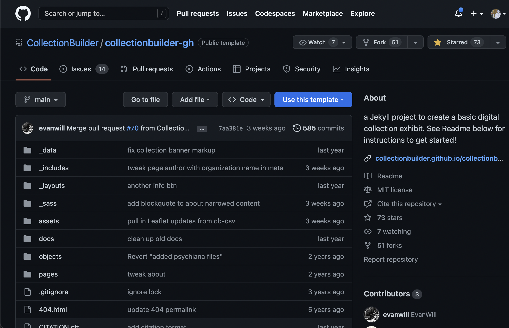
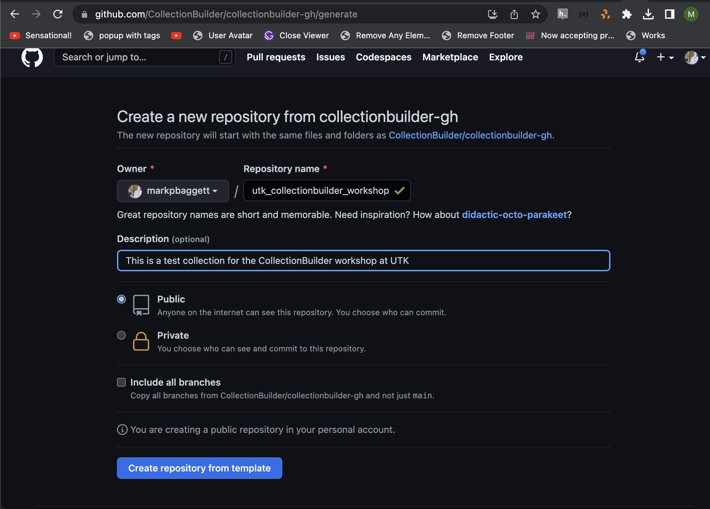
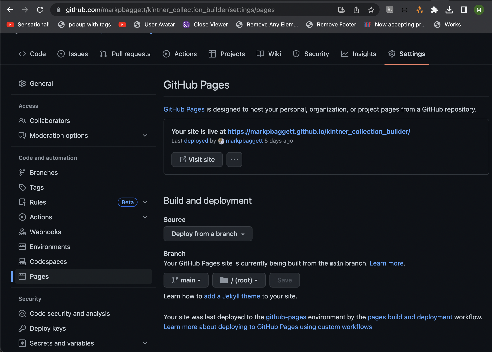

Getting Started: Deploying a CollectionBuilder-GH Site
======================================================

Outcomes
--------

* Create a new collection using CollectionBuilder-GH
* Configure GitHub Pages to serve your collection
* Understand the various visualizations that CollectionBuilder provides

Overview of GitHub and GitHub Pages
-----------------------------------

To begin, we're going to visit the `CollectionBuilder-GH <https://github.com/CollectionBuilder/collectionbuilder-gh>`_
repository on GitHub and start a new collection.  At this point you need to be logged in to GitHub if you want to follow
along. If you're a person who learns by simply watching, feel free to do that if you prefer.

GH stands for "GitHub Pages." GitHub pages is a feature that GitHub provides for hosting static websites (in our case
using Jekyll).  It's free, and it's easy to set up.  You can read more about it `here <https://pages.github.com/>`_. As
we move forward, we'll talk more about GitHub Pages and Jekyll.

If I'm moving to fast or if you have questions, feel free to ask them in the chat.

Before we move forward, I'll just do a quick overview of the GitHub interface.

* Owner (GitHub Member or Organization):  In the upper left corner, you'll see the name of the owner of the repository.
  In this case, it's "CollectionBuilder."  This is the name of the GitHub organization that owns the repository.  If
  you're working on your own collection, you'll see your own name here.
* Repository Name:  In the upper left corner, you'll see the name of the repository.  In this case, it's
  "collectionbuilder-gh."  This is the name of the repository that we're working in. A repository is a collection of
  directories and files that are related to a project. The repository uses a version control system called Git to track
  diffences between each file and directory.
* Directories and Files:  In the middle of the screen, you'll see a list of directories and files.  These are the
  directories and files that are part of the repository. If you're the owner of the repository, you can edit these
  directly in the browser.
* Commit messages: Next to each file or directory you can see a commit message.  These are messages that describe
  the changes that were last made to the file or directory. To the right of the commit message, you can see when that
  last change was made.
* Commits: In the upper rights, we can see a history of everything that has happened to this repository since its been
  created. By clicking on a commit, we can see what was changed at that point in time.

That's probably enough for now, but we'll talk more about GitHub and GitHub Pages as we move forward.

Creating a New Collection
-------------------------

To get started, click the green "Use this template" button in the upper right corner of the screen.  This will create a
new repository in your GitHub account that is a copy of the CollectionBuilder-GH repository. Again, you need to be logged
in to Github at this point.

You can name the repository anything you want, but it's probably best to name it something that is related to your
collection.  For example, you might name this :code:`utk_collectionbuilder_workshop`. One thing to keep in mind is that whatever
you name your repository will be used by GitHub to create the URL for your collection, so make sure you choose a name that
you're happy with when you're doing this in the future. Also, case matters, so I recommend to always use lowercase letters
here.

You can also add a description. The description helps you remember what this was and let's others understand what this repository
was for. For example, you might say "This is a test collection for the CollectionBuilder workshop at UTK."

You can make your repository public or private.  If you make it public, anyone can see it.  If you make it private, only
you and your collaborators can see it.  That being said, you need your repository to be public in order to use GitHub Pages.
If your repository is set to private, then Github Pages won't be able to serve the files to the public, and therefore won't work.

Finally, there is a checkbox for "Include all branches." We don't need to check this as we only need the main branch.

Once you've filled out the form, click the green "Create repository from template" button.  This will create a new repository
in the account you chose above.

Getting Your New Collection to the Web
--------------------------------------

Once the repository is created, you'll be taken to the repository page.  You can see that the name of the repository is
whatever you selected originally. You can also see that you have 1 commit so now future edits we can easily differentiate
between your changes and the initial repository.

The first thing we are going to do is enable GitHub pages.  We can do that by clicking on the "Settings" tab in the upper
right hand corner of the navigation bar.

This will take us to the settings page for the repository. On the left hand side, we can see a list of settings.  We're
looking for the **Pages** section. Once you find it, click it.

Under the Pages section, we can see that GitHub Pages is currently disabled.  We can enable it by clicking the "Select branch"
dropdown and selecting the main branch.  Leave the next dropdown as :code:`/(root)`. Once you've done that, click the
"Save" button.

Once you've done that, you'll see a message that says "Your site is ready to be published at ...". Copy that link and
let's return to the main page for the repository. We're going to save that link here so its easy to remember where to find
our collection.

Click the **Gear** icon in the upper right hand corner and paste the link you copied into the "Website" field and click
save changes.

Now you can see your site link in the upper right hand corner of the screen in the about section.

You may notice that there is now a green check mark next to the initial commit message. If there is a green check mark,
that means our GitHub Pages site is ready.  If it's a yellow circle, that indicates it is still building.  If it's a red
X, that means there was an error and we did something wrong.

Reviewing the CollectionBuilder Demo Site
-----------------------------------------

Assuming you have a green check mark, you can click the link to your site to visit it. You should see a page with the
standard demo CollectionBuilder content.  If you don't see that, let me know in the chat.

=========
Home Page
=========

The home page is the first page that people will see when they visit your site. This page provides an overview of what
is found in your collection

This includes:

1. a brief description that can point to your about page with more information.
2. the time span for the collection.
3. the top subjects and locations found in the collection.
4. an overview of the types of objects found within the collection.
5. a nice carousel of images from the collection.

===========
Browse Page
===========

The browse page includes links to all the items in the collection.  Most other pages will leverage data from this section
and / or refer people back to these pages.

=========
Item Page
=========

The item page is the page that is created for each item in the collection.  This page includes the metadata you provide
about each work. It also provides links to features you can use to visualize each work.

========
Subjects
========

Subjects are a word cloud that include the most popular data found within the collection. If you click one of these, it
refers you back to browse with only the matching objects in the results.

=========
Locations
=========

Locations like subjects are a word cloud that include the most popular data found within the collection. If you click
one of these, it refers you back to browse with only the matching objects in the results.

===
Map
===

The map feature gives you a map cluster of the works in the collection. Clicking a cluster will link you to all the objects
that are geospatially related to the cluster.

========
Timeline
========

The timeline let's you chronologically explore all the works in the collection.

====
Data
====

The data page provides a table based browse of all the metadata in the collection. It also provides lists of data in popular
formats to help others easily reuse your data for other sites or research.

This data feature is also found on the front page of each site.

=====
About
=====

Finally, we have the about page.  This page is fully customizeable and allows you to provide more information about your
collections and the works found within it.

One of the major features of CollectionBuilder is providing an easy way to edit your about pages and reuse the objects related
to each work without the need for code, so we'll do that a little more as we more forward.
