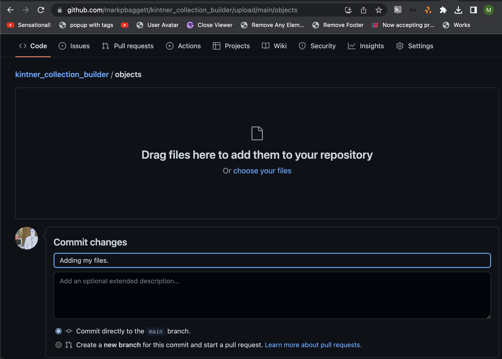
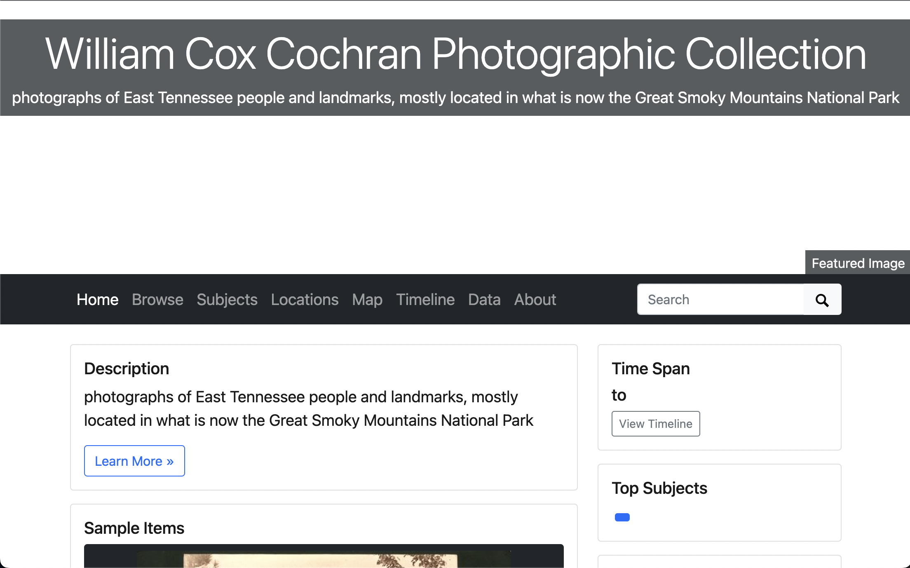
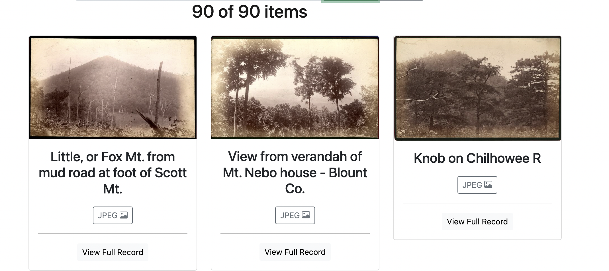
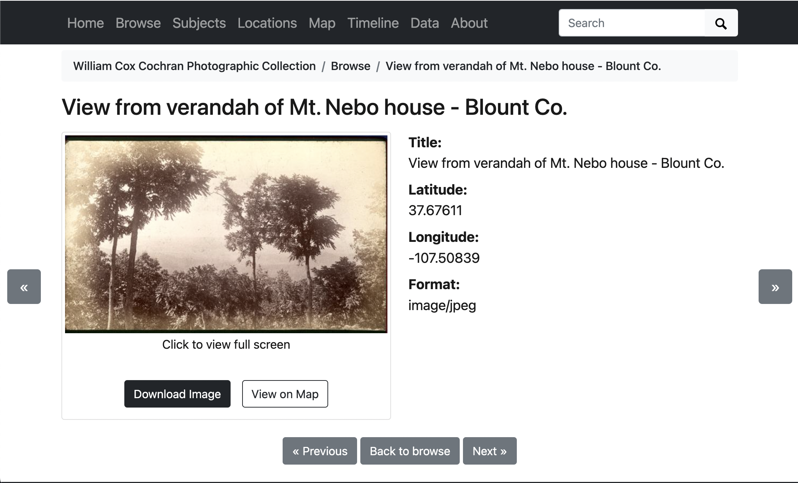
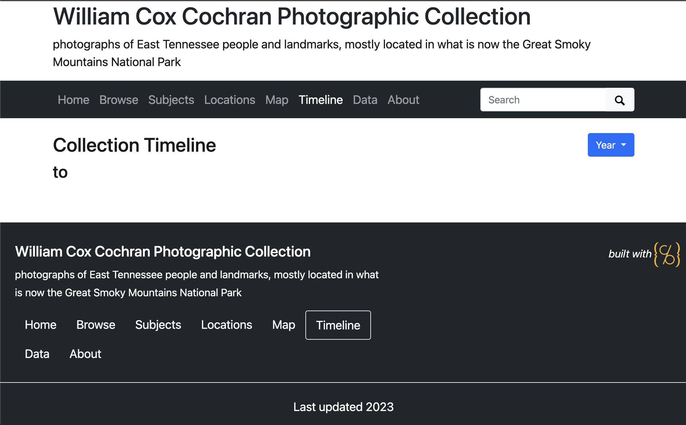
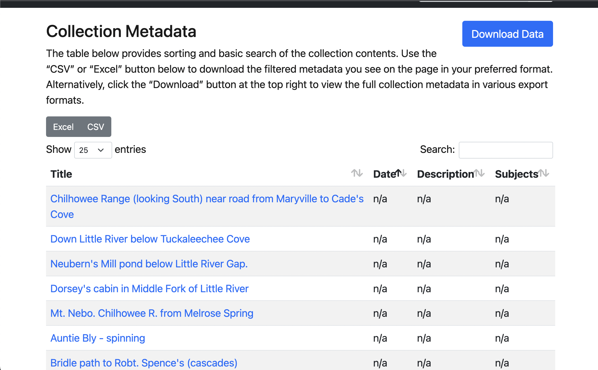
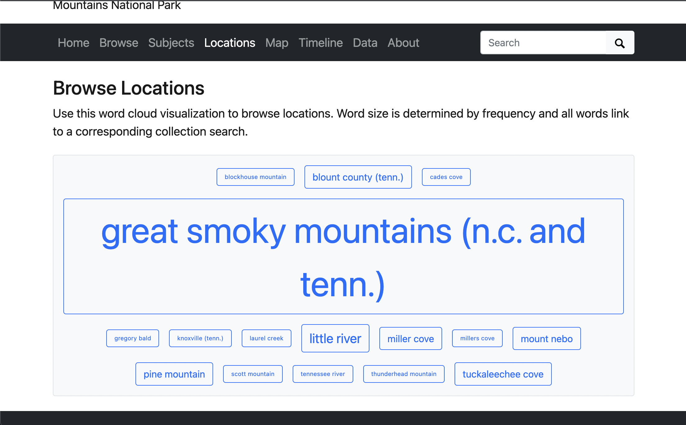
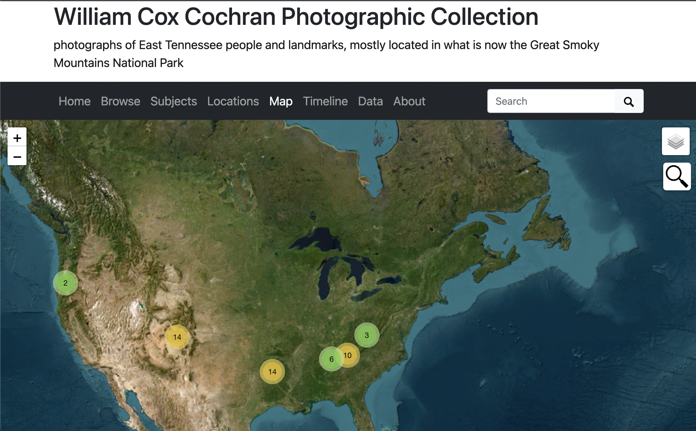

Adding Original Content to CollectionBuilder
============================================

Outcomes
--------

* Understand how CollectionBuilder reads in metadata and content
* Understand the types of content you can host with CollectionBuilder
* Understand expectations for metadata and file structure
* Understand how to replace the built-in content with your own

CollectionBuilder-GH Content
-------------------------

CollectionBuilder-GH is designed for small collections. A GitHub repository can only be 1GB in size, so this limits not only
how many items a collection may have, but also the types of files a collection may contain.

CollectionBuilder-GH supports a small set of object types including jpg, png, pdf, and mp3, plus externally hosted items
via YouTube, Vimeo, and external links. With the exception of YouTube, Vimeo, and external links, all object files are placed in the
:code:`objects` folder directly in your project repository and will be committed to GitHub. No access derivatives will be generated,
meaning the full sized objects you add to the project will be displayed on web pages through out the site. It also means
no thumbnails will be created for non-image items.

If you have needs for bigger collections or derivative generation, you can migrate your CollectionBuilder-GH site to
CollectionBuilder-CSV at a later date.

Guidelines for CollectionBuilder-GH Content
-------------------------------------------

* **Supported formats**: jpg, png, pdf, mp3 – plus YouTube, Vimeo, and external links, but you won’t have objects for those!
* **File size**: since there are no thumbnails generated, keep your object files at a reasonable size for access on the web. This means you will usually not be using your full resolution versions! For example, jpeg images of about 1200px wide and PDFs less than 1 MB will work well. Larger objects (especially images) will slow load times and make your users download unnecessarily large data–so keep them to a web friendly size!
* **Total size**: GitHub repositories have soft limits on total size, some where around 1 GB. A good rule of thumb is to keep your “objects” folder less than 500 MB.
* **Filenaming**: to avoid issues, please pay close attention to filenaming conventions! The filename should be an all lowercase unique string with no spaces or special characters. Underscores (_) are okay. You will use the exact filenames (including extension and same case) to populate the “filename” field of your collection metadata.

Adding Sample Objects to Our GitHub Repository
----------------------------------------------

To save time, I've pulled together some sample objects to use in our demo collection. You can download the zip file
`here <https://drive.google.com/file/d/1nAsc76GSBSdyjW_d77b2lVOzgd8qLLwm/view?usp=sharing>`_.

Now, we're going to extract this zip file and add the contents to our GitHub repository.

To do this, we need to open the zip file and extract the contents. On a Mac, you can double click the zip file to open
and extract it.  On Windows, you can right click the zip file and select "Extract All".

Next, we're going to navigate to the :code:`objects` directory in our GitHub repository. This is the repository where
you can add the files you want to host in your project if you are not using external links, youtube, or vimeo.

Now, in our GitHub repository, we're going to click **Add File** and select **Upload Files**. Now drag each of the files
you just extracted to your repository.

You may notice that there are a few demo files, but let's leave them there for now. They won't show up in our collection
unless we add them to our metadata.

Finally, scroll down to the “Commit changes” box, write a short commit message in the form (an appropriate message might
be “add collection objects to project”), then click the green “Commit changes” button to add them to your repository.

Adding Metadata about Our Objects
---------------------------------

CollectionBuilder-GH reads in metadata from a comma separated file (CSV). The CSV file can be named whatever you want,
but it must be a CSV file.

Once you've written your metadata, you can upload it to your GitHub repository to the :code:`_data` directory similarly
to how we added our objects.

Before we add our metadata, let's take a look at the prescribed metadata structure for CollectionBuilder-GH.

CollectionBuilder Metadata Application Profile
----------------------------------------------

CollectionBuilder is prescriptive when it comes metadata. Without extensive customization, each project must
have specific fields in order for the collection to work properly.

========
Required
========

For CollectionBuilder-GH, each row must have 4 fields.  All collections should have the following 3 fields:

* **objectid**: This is the field that CollectionBuilder uses to identify each object. This should be a unique string,
  all lowercase with no spaces or special characters as it will be used to form the item’s URL. Underscores (_) and
  dashes (-) are okay; slashes (/) should NOT be used in this field.
* **title**: The title field is used to indicate the name of an item. This should be a short, descriptive set of words
  that identify the item. Each item may only have one title.
* **format**: This field indicates the item’s media type. Since CollectionBuilder uses logic based on format to display
  objects, this is the most important field to ensure the interactive visualizations function correctly. If there are
  errors or anomalies, some pages will not work. The input for this field should be structured according to MIME type
  standards, consisting of a type and a subtype concatenated with a slash (/) between them.

Collections should also have at least 1 of the following fields but can have all 3 if you're using mixed content:

* **filename**: The digital object’s filename including the file extension, or a full URL to a file hosted external to
  your project. The value must exactly match the actual filename of the file in your “objects” directory, including the
  case of the filename and file extension. Most web servers are case sensitive, so make sure everything matches! If you
  are using an external link instead of a file in the :code:`objects` directory, the URL must be a full URL including
  the protocol (http:// or https://). **Important note on external items**: URLs to external media should always be
  secure HTTPS links. Media at HTTP links are likely to be blocked by browser security defaults as mixed content.
* **youtubeid**: This is the unique string assigned to a video when it is uploaded to YouTube. An easy way to find this is
  to look at the url for your YouTube video. The ID will be the string attached to the end of the url. For example, in
  “https://www.youtube.com/watch?v=sHhk1eAgopU” the youtubeid is :code:`sHhk1eAgopU`.
* **vimeoid**: This is the unique string assigned to a video when it is uploaded to Vimeo. An easy way to find this is
  to look at the url for your Vimeo video. The ID will be the string attached to the end of the url. For example, in
  “https://vimeo.com/464555587” the vimeoid is :code:`464555587`.

===========================
Required for Visualizations
===========================

CollectionBuilder uses these fields to generate contextual visualizations, including a map, timeline, and word clouds
reflecting the frequency of subjects and locations in a collection.

* **latitude**:  A geographic coordinate specifying the north-south position of an item.
* **longitude**: A geographic coordinate specifying the east-west position of an item.
* **date**: This field indicates a point in time associated with the item. This date field will be used for sorting and
  displaying on a timeline, so may often be an estimated / approximate date, rather than one more precisely formatted to
  archival description standards. We suggest adding more complex descriptions of date (date ranges, uncertainties, etc)
  in a separate field such as “date_created”. Dates should be represented in the format :code:`yyyy-mm-dd`, which will enable
  our various timeline visualizations. See the Timeline section for more details. For less exact dates, :code:`yyyy-mm`
  or :code:`yyyy` may be used.
* **subject**: The subject field contains topic(s) related to the item. This field allows for multiple subjects to be
  input for a single record. Each should be separated with a semicolon (:code:`;`).
* **location**: This field designates a geographic location(s) to which the item is tied. Much like the subject field,
  this field will build a tag cloud of the most used locations in your collection. See the Locations section for more
  information. Be sure to separate multiple location entries for a single record with a semicolon (:code:`;`).

==========================================
Optional Fields that Work "Out of the Box"
==========================================

The rest of the fields in the CollectionBuilder metadata template are not required for CollectionBuilder or its
visualizations to work, but their use is encouraged to ensure a richly informative collection. Also, while you can add
any field you want to your metadata it will require you to customize some things in order to get that value to show.

These optional values will appear without any extra work:

* **creator**: The creator property designates an entity primarily responsible for making the resource.
  Multiple creators may be input, as long as each is separated by a semicolon (:code:`;`).
* **description**: The description should be a brief account of the object. Each object should only have one description.
* **source**: The source field designates a related source collection or resource from which the object is derived.
  This field is especially relevant for digitized archival collections. In such a situation, the name of the physical
  archival collection would be the input for this field. The input should be expressed as the collection name followed
  by a comma, then followed by the holding library.
* **identifier**: The identifier field is used to preserve the unique identifier assigned to the object by the object’s
  (usually physical) source collection.
* **type**: An object’s type distinguishes between types of image, sound, text, etc. using a one- or two-value input.
  At minimum, the input should contain a value chosen from the DCMI Type Vocabulary. If using a second value, the second
  value does not need to relate to a controlled vocabulary, but should give further specification of the object type.
  The two values in a pair should be separated by a semicolon (;).
* **language**: This field indicates the language associated with the object. Recommended best practice is to use a
  controlled vocabulary such as the ISO 639-2 Codes for the Representation of Names and Languages to designate language
  tags.
* **rights**: The rights field should include a free-text rights statement describing information about rights held in and over the object.
* **rightsstatement**: This field is a standardized rights statement, designated in the form of a URI. It should be
  presented as a creativecommons.org URI or a rightsstatements.org URI.

Editing Metadata
----------------

Now that we know what fields we need, let's modify some existing messy metadata I've created to match these expectations.

To do that, click `this link <https://docs.google.com/spreadsheets/d/12AtVzUzsQ4lv90634CZpZ7Ex_fLuZ1qG03FLCoyT6LY/edit#gid=1843475809>`_.
Then, click `File > Make a Copy` to create your own editable copy of the metadata template.

===================
Add Required Fields
===================

First, let's make sure our metadata template has each of the required fields.

1. Change :code:`source_identifier` to :code:`objectid`.  Remember, this is the unique identifier for each item in your collection.
   In this existing data, this is the persistent identifier for the collection so it should be unique already. If you were
   doing this with your own data, you'd need to do something to ensure this data was unique.
2. Next, we need to make sure we have a column for our title which is a required field. **Column G** should contain our titles already.
3. Next, we need to make sure we have a properly formatted format so that our works in this collection will all be displayed.
   Remember, CollectionBuilder uses :code:`mime/type` to do this, but it may not be the actual mime type. Instead, it should
   be a prescribed mime/type from CollectionBuilder (in this case :code:`image/jpeg`). Let's change column B to :code:`format`.
   Then, let's change the values in column B to :code:`image/jpeg` for all of our images.
4. Finally, we need to make sure our metadata matches the files we added to :code:`objects` a little bit ago. Those are all named
   like the value in Column A but with the :code:`:` replaced with an :code:`_` and :code:`.jpg` added to the end. We can
   add this easily with just a tiny bit of spreadsheet magic. Add a new column after column B. Then, in column C, add the following formula:
   :code:`=CONCATENATE(SUBSTITUTE(A2, ":", "_"), ".jpg")`.  Now drag this to the bottom of our sheet.

Now let's add this file to our project.  To do that, click :code:`File` then :code:`Download` then :code:`Comma-separated values (.csv, current sheet)`.

Then, go back to your GitHub repository and upload the file to the :code:`_data` folder.  You can do this by clicking :code:`Add file` then :code:`Upload files`.

========================================
Editing Default Settings and YAML Basics
========================================

Now, we need to tell our CollectionBuilder site to use this file.  To do that, we need to edit the :code:`_config.yml`.

Let's open that file and edit some settings.

This file is formatted as YAML.  YAML is a human-readable data serialization language.  It's used by many projects for
configuration files because it's human readable, easy to edit, and easy to parse.  You can learn more about YAML `here <https://en.wikipedia.org/wiki/YAML>`_.

If a line starts with :code:`#`, that means it's a comment and will be ignored by the computer that interprets the command.

Let's skip the optional URL Variables section for now and go straight to the Site Settings section.

Here we can modify the title of our site, the tagline, the description, and the creator.

Let's change the title to :code:`William Cox Cochran Photographic Collection`.  This will modify the title that appears
throughout our site.

Let's also change the tagline and description to :code:`Photographs of East Tennessee people and landmarks, mostly located in what is now the Great Smoky Mountains National Park`.

Next, let's change the author to your GitHub name.

Finally, let's switch the value of :code:`metadata` to the name of our csv without the extension, :code:`wcc_messy`.

.. code:: yaml

    ##########
    # SITE SETTINGS
    #
    # title of site appears in banner
    title: William Cox Cochran Photographic Collection
    # tagline, a short phrase that will appear throughout the site in the top banner
    tagline: photographs of East Tennessee people and landmarks, mostly located in what is now the Great Smoky Mountains National Park
    # description appears in meta tags and other locations
    # this description might appear in search result lists, keep around 160 characters max
    description: "photographs of East Tennessee people and landmarks, mostly located in what is now the Great Smoky Mountains National Park"
    # creator of the digital collection, to appear in meta tags; we typically use our GitHub usernames but feel free to just use your name
    author: markpbaggett

    ##########
    # COLLECTION SETTINGS
    #
    # Set the metadata for your collection (the name of the csv file in your _data directory that describes the objects in your collection)
    # Use the filename of your CSV **without** the ".csv" extension! E.g. _data/demo-metadata.csv --> "demo-metadata"
    metadata: wcc_messy

Reviewing Our Data after Initial Changes
----------------------------------------

Now that we've made our initial changes, let's check our site to review what's working and what is not.

========
Homepage
========

From the home page, you should see:

* that the title, tagline, and description have all changed.
* the sample items slider has updated to have our new images
* we have 90 objects
* none of the other faceting seems to be working
* the featured image isn't working

======
Browse
======

On the browse page, we can see that our new images are appearing, but many of the metadata fields are not working on the brief results section.

============
Full Results
============

If we click on one of the items, we can see that the full results page is working, but our metadata is looking empty.

===========
Word Clouds
===========

If we look at the "Subjects" and "Locations" word clouds, we should see that both are empty and not working as expected.

.. image:: ../images/messy_word_clouds.png

===
Map
===

If we look at the map, we should see things appearing on it, but not zooming in where we'd like.

========
Timeline
========

If we look at the timeline, we should see that it's not working at all.

====
Data
====

If we look at the data page, we should see that the data is not working like we want either.

Cleaning Up Data to Improve Visualizations
------------------------------------------

Let's go back to our Google Sheet and modify it to make our visualizations work better.

======================
Correcting Word Clouds
======================

By default, CollectionBuilder builds the "Subjects" word cloud around what's in the :code:`subject` or :code:`creator` field.

If we look at our metadata, we have neither of these fields.  Instead, we have :code:`keyword` and :code:`utk_photographer`.  We also have a
:code:`utk_donor` field.

To get the subjects cloud working, lets rename "utk_photographer" to "creator" and "keyword" to "subject."

Similarly, the "Locations" word cloud looks at the "location" field, but this information is currently stored in "spatial_local" in our sheet.

Let's rename "spatial_local" to "location."

Finally, you may have noticed that all of our current data in the spreadsheet is delimited by a :code:` | ` but CollectionBuilder expects
data to be delimited as :code:`; `.  Let's fix that in Google Sheets by doing a global find and replace by going to "Edit" and "Find and Replace"
and clicking "Replace all."

.. image:: find_and_replace.png

Now, let's download our CSV and re-upload it to our GitHub repository.

We should now see that both word clouds work as expected:

Even though these work, let's pretend that we wanted to also include our donor field in the "Subjects" word cloud. We can
do that by editing a yaml file in CollectionBuilder.

Let's open :code:`_data/theme.yml` and add :code:`utk_donor` to our subjects cloud by editing line 26 to look like this:

.. code:: yaml

    ##########
    # SUBJECTS PAGE
    #
    subjects-fields: subject;creator;utk_donor # set the field to be featured in the cloud (if left blank, none will be generated)
    subjects-min: 1 # min size for subject cloud, too many terms = slow load time!
    subjects-stopwords: # boxers;boxing;boxer # set of subjects separated by ;, e.g. boxers;boxing

Notice you can also change the minimum size of the words in the cloud and add stopwords, or words that you don't want to appear in the cloud.

====================================
Configuring Other Parts of theme.yml
====================================

Before we move and fix anything else, let's look at :code:`theme.yml` a little closer and modify some settings there.

Under :code:`Home page`, we can set our featured image that will be used across our collection.

Let's set that to :code:`wcc:313` or another :code:`objectid` in our collection.

.. code:: yaml

    ##########
    # HOME PAGE
    #
    # featured image is used in home page banner and in meta markup to represent the collection
    # use either an objectid (from an item in this collect), a relative location of an image in this repo (ex. /assets/img/feature.jpg), or a full url to an image elsewhere
    featured-image: wcc:313
    # optional: add extra padding around collection title for a larger image feature.
    home-title-y-padding: 10em # Default is 8em
    # optional: change position of background image, center, top, bottom
    home-banner-image-position: # Default is center

Remember that our :code:`Map` feature was working, but not zooming in where we'd like.  We can fix that in :code:`theme.yml`.

Let's change the :code:`latitude`, :code:`longitude` and :code:`zoom-level`.

You can also modify your map-base.

.. code:: yaml

    ##########
    # MAP PAGE
    #
    # see _data/map-config.csv for field display options
    latitude: 35.49973 #to determine center of map
    longitude: -83.62116 #to determine center of map
    zoom-level: 4 # zoom level for map
    map-base: Esri_NatGeoWorldMap # set default base map, choose from: Esri_WorldStreetMap, Esri_NatGeoWorldMap, Esri_WorldImagery
    map-search: true # true/false, not suggested with large collections
    map-search-fuzziness: 0.35 # fuzzy search range from 1 = anything to 0 = exact match only
    map-cluster: true # true/false, suggested for large collection or with many items in same location
    map-cluster-radius: 25 # size of clusters, from ~ 10 to 80

=================
Timeline and Data
=================

Next let's correct a few more prescribed fields in our metadata to match what CollectionBuilder expects.

1. Let's change :code:`local_identifier` to :code:`identifier` in our Google Sheet.
2. Let's change :code:`abstract` to :code:`description` in our Google Sheet.
3. Let's change :code:`date_created_d` to :code:`date` in our Google Sheet.
4. Let's change :code:`rights_statement` to :code:`rightsstatement` in our Google Sheet.
5. Let's change :code:`archival_collection` to :code:`source` in our Google Sheet.

Now, we should see both the timeline and data pages working as expected.

We should also see that our full results page looks much more robust.

Note:  the timeling is designed to work with dates in the format :code:`YYYY-MM-DD` or :code:`YYYY-MM` or :code:`YYYY`.

That being said, it wil only organize dates by year, so this isn't a great feature for our current collection.
