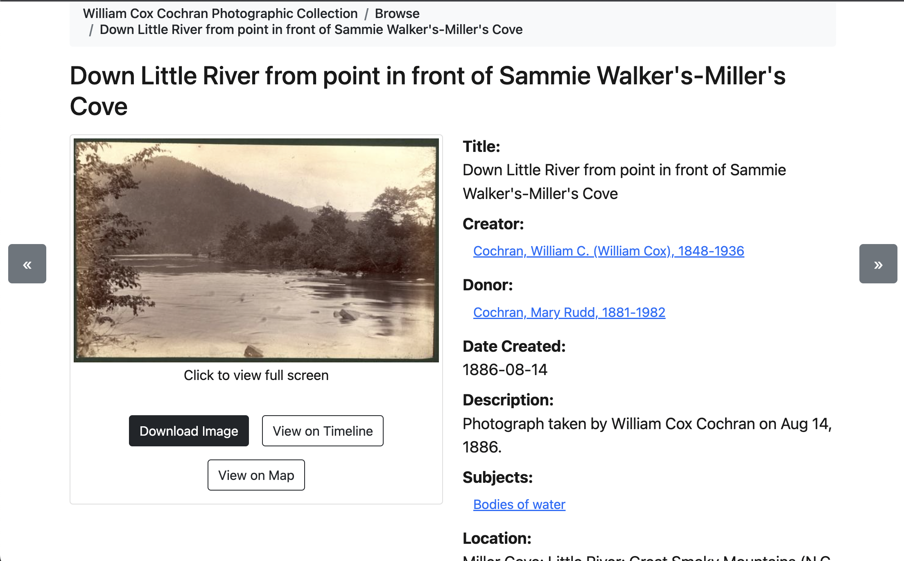

Additional Customization Options
================================

Outcomes:
---------

* Understand how advanced customization of CollectionBuilder Components work

Adding Missing Metadata Fields
------------------------------

If you want to add a new metadata field to the list of fields that are not prescribed by CollectionBuilder, that's easy
to do.

To see this in action, let's get metadata from our spreadsheet that isn't currently working to display on the item page.

Currently, these fields are not being displayed on the item page:

1. utk_donor
2. date_created
3. provider
4. repository

Let's add them to the item page by modifying :code:`_data/config-metadata.csv`.

In this file, we can set the initial field name, the display name, whether we want it to be a browse field, and whether
it should be an external link. We can also set the order in which the fields should appear on the item page.

The field name is the field where that data is stored in our spread sheet.

The display name is the descriptive string we want to associate with that field.

The browse field option is used to determine whether or not we want to link this field to a search on the browse page.

Finally, the external link option is used to link external resources to the item page.

To begin, let's add :code:`utk_donor` to the list of fields in :code:`_data/config-metadata.csv` and make it searchable
underneather :code:`Creator`.  Let's also make the :code:`Creator` field searchable:

.. code-block:: csv

    field_name,display_name,browse_link,external_link
    title,Title,
    creator,Creator,true,
    utk_donor,Donor,true,

Now, let's test our change.

Notice that both :code:`Creator` and :code:`Donor` are now searchable on the browse page, but
only ::code:`Creator` returns results.  This is because we have to add :code:`Donor`to our search index.

To do this, we need to add :code:`utk_donor` to the list of fields in :code:`_data/config-browse.csv`:

.. code-block:: csv

    field,display_name,btn,hidden,sort_name
    date,Date,,,Date
    creator,Creator,,,
    utk_donor,Donor,,true,
    subject,,true
    location,,true

Adding it like the above will display in on the browse page and make it searchable.  If we wanted to make it searchable
but not display here, we could set :code:`hidden` to :code:`true`.

Customizing Map Display
-----------------------

Like above, we can also modify how the map cluster results are displayed.

We can do that by modifying :code:`_data/config-map.csv`.

We can add our donor information here as well in the same way:

.. code:: csv

    field,display_name,search
    date,Date,true
    creator,Creator,true
    subject,Subjects,true
    location,Location,true
    utk_donor,Donor,true

Expanding Data in the Data Table
--------------------------------

Let's modify the data in our data table to include the :code:`location` field like so:

..code:: csv

    field,display_name
    title,Title
    date,Date
    description,Description
    subject,Subjects
    location,Locations

Expanding Fields that are Available in Our Search Index
-------------------------------------------------------

By default, not all metadata fields are available in our search index.  We can add them by modifying :code:`_data/config-search.csv`.

Here, we can add fields and set if they are in our search index and if they appear in our search results if we match on
that term.  Let's add :code:`utk_donor` to our search index but not display it in our search results:

.. code:: csv

    field,index,display
    title,true,true
    date,true,true
    creator,true,false
    description,true,true
    subject,true,true
    location,true,false
    utk_donor,true,false

Modifying Nav
-------------

We can modify the navigation bar by modifying :code:`_data/config-nav.csv`.

Here, we can set the order of the navigation bar and the text that appears in the navigation bar. We can also removed
unwanted or unused components.

For now, let's remove the "Timeline" component since our timeline data isn't great.

.. code:: csv

    display_name,stub,dropdown_parent
    Home,/
    Browse,/browse.html
    Subjects,/subjects.html
    Locations,/locations.html
    Map,/map.html
    Data,/data.html
    About,/about.html
