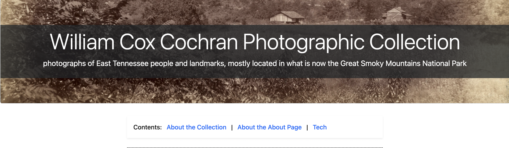
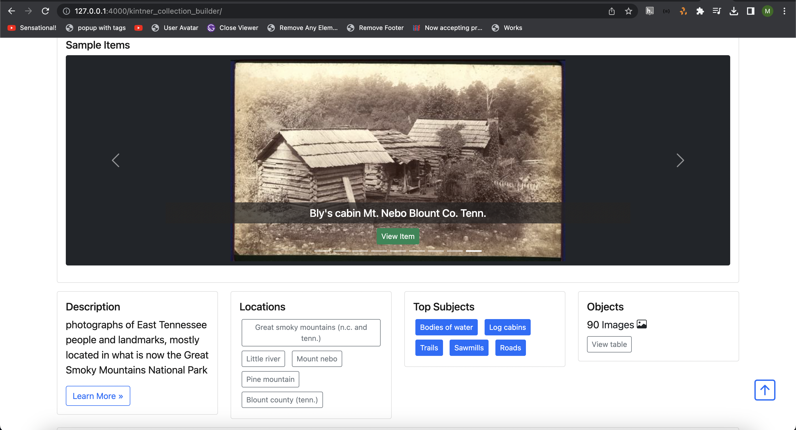
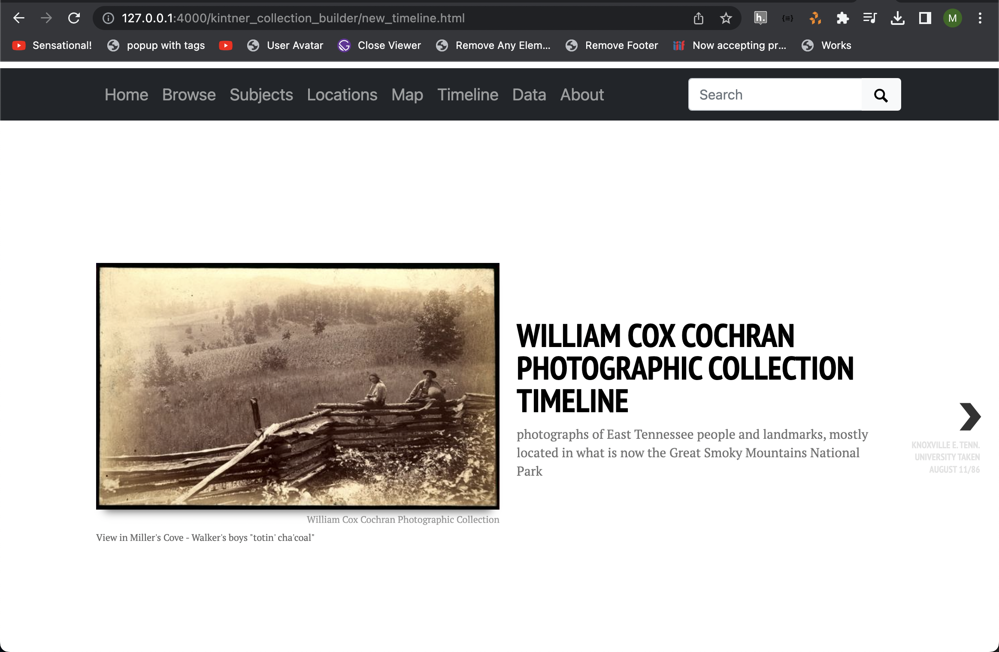

Jekyll, Liquid, and Customizing Pages
=====================================

Objectives:
-----------

* Understand how CollectionBuilder uses Jekyll, Liquid, and Markdown to build pages
* Understand how to make your own customizations to layout and page content

How Pages are Built in CollectionBuilder
----------------------------------------

CollectionBuilder relies on 4 technologies along with its source code to build out collections and their associated pages:

* `Jekyll <https://jekyllrb.com/>`_
* `Liquid <https://shopify.github.io/liquid/>`_
* `Bootstrap <https://getbootstrap.com/>`_
* `Markdown <https://www.markdownguide.org/>`_

Understanding how these work together will help you make modifications to the layout and functionality of your
CollectionBuilder site.

====================
Understanding Jekyll
====================

Jekyll is one of the most popular and actively developed static site generators, in part because of its direct
integration with GitHub Pages. Originally focused on creating simple blogs from Markdown files, it has developed into a
fully featured generator used on all types of web projects.

Jekyll is written in the programming language Ruby and is installed on your computer or a server as a Ruby Gem. However,
you don’t need to know anything about Ruby to get started using it!

The most important thing to understand about Jekyll is how a Jekyll project is laid out. In fact, some of this we've
already used today.

1. :code:`_config.yml`: This file contains the configuration options for your Jekyll site, including settings such as the site title, description, and base URL.
2. :code:`_layouts`: This folder contains templates for the various types of pages on your site. For example, here you will find a layout for your homepage, your about page, and even components such as the word cloud.
3. :code:`_includes`: This folder contains reusable pieces of HTML code that can be included in your layouts or pages. For example, you might have an include file for your header, footer, or navigation menu. We'll talk more about includes and layouts in just a minute.
4. :code:`_sass`: This folder contains the Sass files for your site's stylesheets. If you're using Sass, you can organize your styles into separate files and use partials to import them into your main stylesheet.
5. :code:`pages`: This folder contains the Markdown files for your pages. Each file in this folder will be converted into an HTML page on your site.

====================
Understanding Liquid
====================

Liquid is a flexible template language. In Jekyll it allows you to layout pages built from modular components and data,
using the “_includes”, “_layouts”, and “_data” directories. Liquid includes features such as operators, loops, and
filters to manipulate raw content. Liquid statements are enclosed by :code:`` and variables in :code:`{{ }}`.

In just a few minutes, we will play around with some Liquid includes to modify the components we use on our pages.

======================
Understanding Markdown
======================

Markdown is a standard to simplify writing content for the web. Considered a “lightweight” markup language, it provides
a set of conventions to create documents in plain text that can be converted into HTML. The basics are intuitive,
modeled after how you might naturally write an email, and are intended to be easy to read for a human
(compared to HTML source code!).

We will use Markdown to write the content of our pages and format it to some extent.

=======================
Understanding Bootstrap
=======================

CollectionBuilder uses Bootstrap to provide a responsive, mobile-first framework for building pages. Bootstrap is a
package of CSS and JS that provides grid, layout, and UI components that can be used to quickly build and style a
responsive website.

Described as “the world’s most popular framework for building responsive, mobile-first sites”, Bootstrap is a package
of CSS and JS that provides grid, layout, and UI components that can be used to quickly build and style a responsive
website.

CollectionBuilder currently uses version 5.1 as a base. This allows you to use Bootstrap columns, components, and
utilities to customize your pages.

Today, we will modify the layout of our home page using Bootstrap columns and components.

=======================
Includes versus Layouts
=======================

In Jekyll, layouts and includes are two key concepts that allow you to define the structure and style of your website.

Layouts are templates that define the overall structure and design of your website, including headers, footers,
sidebars, and content areas. They are typically written in HTML and can include liquid tags (includes) to dynamically
generate content. When you create a new page or post in Jekyll, you can specify which layout to use for that content.

Includes, on the other hand, are reusable code snippets that can be included in your layouts or pages. They can contain
things like navigation menus, headers, footers, or other elements that appear on multiple pages of your website. Like
layouts, includes can also be written in HTML and can contain liquid tags to dynamically generate content.

In general, layouts are used to define the overall structure and design of your website, while includes are used to
insert reusable code snippets into your layouts and pages.

To understand the difference between layouts and includes in a Jekyll project, it's helpful to think of layouts as the
"skeleton" of your website, while includes are the "organs" that make up the different parts of your website.

Adding About-ness
-----------------

Perhaps the most important thing you'll want to do for your collection is to modify the "About" page and add your own
information and features.

CollectionBuilder comes with a customizable “About” page layout designed for long form content with rich media embeds.
Content is written in Markdown and enhanced using “includes” that pull in collection content, external media, and
Bootstrap features like cards and modals. This makes it easier for site builders to develop their collection and
add interesting and engaging contextual information.

Each “include” file has several options, which are documented in the files themselves.

Before we get started, let's take a quick look at the **Card** Feature at :code:`_includes/feature/card.html`:

.. code:: jekyll

    

        Bootstrap Card, https://getbootstrap.com/docs/5.1/components/card/

        E.G. --> 

        Options:
        - "text" = main card text, can use markdown formatting (tip: use a Liquid capture to add more complex content)
        - "header" = card header text (in bar above card content)
        - "title" = card title text inside card content area
        - "objectid" = the given object or link to external image will create a card cap image
        - "alt" = if adding an external image using objectid option, provide alt text for image
        - "width" = will use responsive sizing to set the % size on desktop (will be 100% on mobile), choose from "25", "50", "75", or "100"
        - "centered" = give "true" to add mx-auto class on the card to center it

    

Modifying the Banner
--------------------

Let's use Liquid to modify the banner on the About page.

The banner is a Bootstrap jumbotron, and can be modified in the `_includes/feature/banner.html` file. Instead of modifying
the functionality, we're going to simply update the image that is being used.

To do that, we're going to update the include like so to point at a region of one of the images in our collection from
the Libraries' IIIF server:

.. code:: markdown

    {% include feature/jumbotron.html objectid="https://digital.lib.utk.edu/iiif/2/collections~islandora~object~wcc%3A268~datastream~JP2/60,1965,5275,1326/full/0/default.jpg" %}

Now our banner should look like so:

Adding an About Section
-----------------------

Next, let's add some information about the collection beneath the banner.

.. code:: text

    William Cox Cochran (1848-1936) was an Ohio lawyer, scholar, and trustee of Oberlin College. He served in the Department of the Interior in Washington under his stepfather, Jacob C. Cox. In 1872, after a European tour, Cochran studied law and opened a law office in Cincinnati. Later, he served as clerk of the U.S. Circuit Court of Appeals in Cincinnati. He died at the age of 88.

    William Cox Cochran captured these 89 images of East Tennessee during August 12 thru 30, 1886. The photographs are of East Tennessee people and landmarks, mostly located in what is now the Great Smoky Mountains National Park. There are many photographs of Chilhowee Range, Nebo Mountain, and Miller's Cove.

    The collection includes two photographs of the University of Tennessee-Knoxville. The photographic images in the collection were donated by Miss Mary Rudd Cochran, daughter of W.C. Cochran to the University of Tennessee Libraries in 1959. Click here for the Finding Aid.

    Oberlin College has a collection of Cochran Family Papers that contains other photographs taken by William C. Cochran.

Let's use Markdown to make a link to the Oberlin College Collection and make the first occurrence of "William Cox Cochran" bold.

.. code:: markdown

    [Oberlin College has a collection of Cochran Family Papers](http://oberlinarchives.libraryhost.com/?p=collections/controlcard&id=16) that contains other photographs taken by **William Cox Cochran**.

.. unicode:: markdown

    **William Cox Cochran (1848-1936)** was an Ohio lawyer, scholar, and trustee of Oberlin College. He served in the Department of the Interior in Washington under his stepfather, Jacob C. Cox. In 1872, after a European tour, Cochran studied law and opened a law office in Cincinnati. Later, he served as clerk of the U.S. Circuit Court of Appeals in Cincinnati. He died at the age of 88.

Beneath the second paragraph, we can use Bootstrap cards or the image feature to add sample images that go with this section.

Let's add a new section that will include a Bootstrap card with a title, image, and text.

.. code:: jekyll

    

After the next paragraph, let's add an include that brings in the two images of the University of
Tennessee.

.. code:: jekyll

    

Modifying the Layout of the Home Page
-------------------------------------

So let's get started with some customizations and use some of the things I just mentioned.

Let's look at our home page.

Since our data doesn't work well with the default layout, we're going to modify the home page to look a little better and
we're going to use all the things I just mentioned to do it.

First, let's look at :code:`/_layouts/home-infographic.html`. This is the layout that is used for the home page.

Let's modify it so that our Featured Items span the entire width of our display.

Then, we'll divide the display into 4 columns and put description, locations, top subjects, and objects in each column
removing the Timeline.

To do this, let's modify the carousel include to span the entire width of the display.

.. code:: html

    

        
    

Next, let's look at :code:`/_includes/index/carousel.html`. From here, we can see that we can change the title, height, and
other options.  Let's modify the height to be 400 px, change the title to "Featured Items", and change the btn-color to "success".

.. code:: html

    

        
    

Now, let's split the remaining 4 sections so they each take up 3 columns of our 12 column grid.

.. code:: html

      

        
      

      

        
      

      

        
      

      

        
      

Our home page should now look like this:

Building a New Timeline
-----------------------

Since we dropped the original timeline, let's build a new one using the TimelineJS include.

To do this, navigate to :code:`pages` and create a new file called :code:`newtimeline.md`.  Add the following to the file:

.. code:: text

    ---
    title: Timeline
    layout: timelinejs
    permalink: /new_timeline.html
    # a timeline visualization will be added below the content in this file
    ---



Now, let's edit :code:`_data/config-nav.yml` and add the following after the line that starts with "Map":

.. code:: text

    Timeline,/new_timeline.html

Now, when we navigate to our site, we should see a new timeline feature that leverages TimelineJS.

